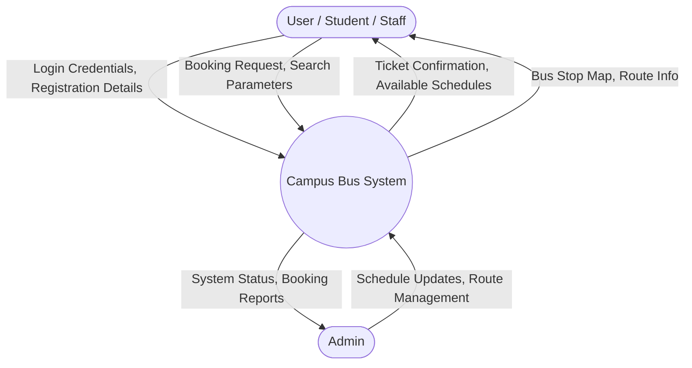
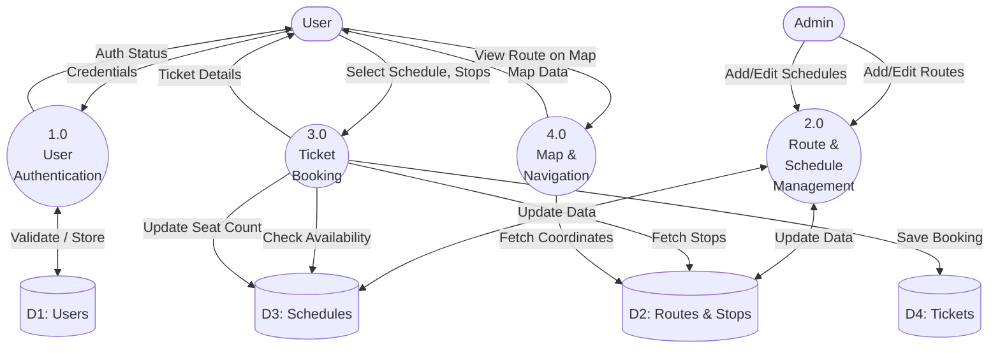
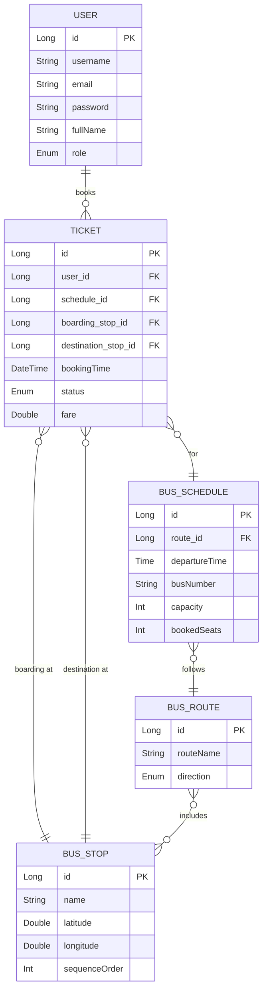
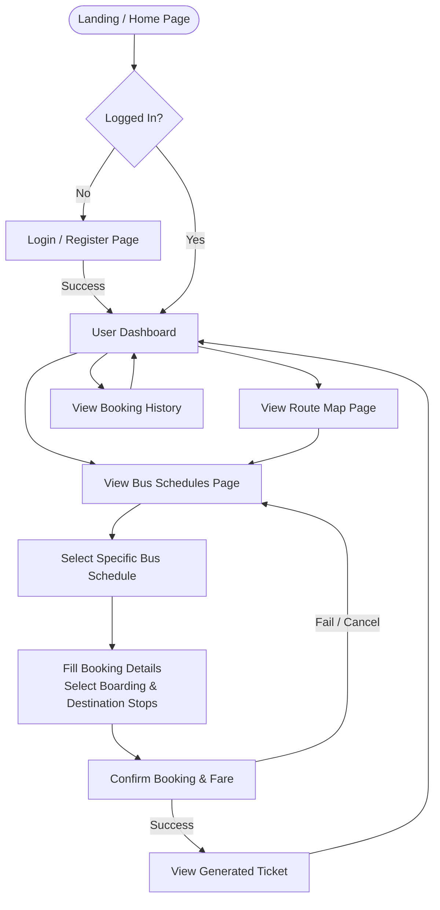

# Campus Bus System Documentation

## Project Overview
The Campus Bus System is a web-based application designed to facilitate the management and booking of bus services within a campus environment (e.g., between Kalyani Junction and ITI More). The platform provides a seamless experience for students and staff to view bus schedules, explore routes with interactive map displays, and book tickets for their commute. It also offers administrative capabilities to manage users, routes, and schedules efficiently.

## Project Description
Built on the Spring Boot framework, the Campus Bus System leverages modern web technologies to deliver a robust and scalable solution. The system consists of five primary entities: `User`, `BusRoute`, `BusStop`, `BusSchedule`, and `Ticket`. 
- **Users** can register, log in, view available buses, and book tickets specifying their boarding and destination stops. 
- **Routes and Stops** are carefully mapped, with each stop containing geographical coordinates (`latitude`, `longitude`) to allow visual representation on a map.
- **Schedules** dictate when buses depart on specific routes and track seat availability (`capacity`, `bookedSeats`).
- **Tickets** serve as the record of a user's booking, capturing fare details, timestamps, and the ticket status.
The system features role-based access control, distinguishing between standard users and administrators, ensuring secure data management and reliable service delivery.

---

## Level 0 Data Flow Diagram (Context Diagram)

The Context Diagram shows the system as a single process interacting with external entities.

---

## Level 1 Data Flow Diagram (DFD)

The Level 1 DFD breaks down the main system into major sub-processes.

---

## Entity-Relationship (ER) Diagram

This ER diagram illustrates the database schema based on the application's models.

---

## GUI Workflow

This flowchart represents the typical user navigation and interaction workflow within the application's graphical user interface.

